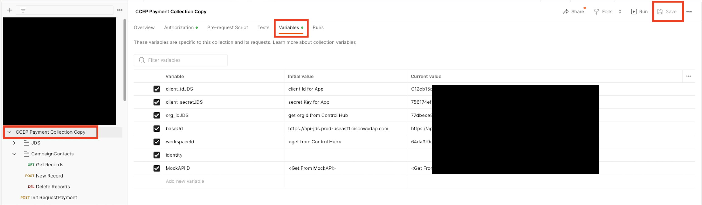

## Demo

*For more demos & PoCs like this, check out our [Collab Toolbox](https://collabtoolbox.cisco.com/).

## License

All contents are licensed under the MIT license. Please see [license](LICENSE) for details.

## Disclaimer

Everything included is for demo and Proof of Concept purposes only. Use of the site is solely at your own risk. This site may contain links to third party content, which we do not warrant, endorse, or assume liability for. These demos are for Cisco Webex usecases, but are not Official Cisco Webex Branded demos.

## Questions
Please contact the CCEP team at [ccep@external.cisco.com](mailto:ccep@external.cisco.com?subject=payment-collections-demo) for questions.

## Table of Contents

[Solution Goals](#solution-goals)

[Reduce Agent & Supervisor Effort](#reduce-agent--supervisor-effort)

[Increase Customer Satisfaction Levels](#increase-customer-satisfaction-levels)

[Create Data To Drive Outbound Campaigns](#create-data-to-drive-outbound-campaigns)

[JDS Event Injection](#jds-event-injection)

[Pre-Requisites](#pre-requisites)

[Implementation](#implementation)

[Required Info](#_Toc156997488)

[Create OAuth Integration](#_Toc156997489)

[Install & Configure Postman Collection](#_Toc156997490)

[Create MockAPI DB](#create-mockapi-db)

[Modify Agent Desktop Layout](#modify-agent-desktop-layout)

[Create Flows In Webex](#create-flows-in-webex)

[Payment Due Workflow](#_Toc156997494)

[Test ‘Payment Due’ Flow](#test-payment-due-flow)

[Payment Confirmed Workflow](#payment-confirmed-workflow)

[Test ‘Payment Confirmed’ Flow](#test-payment-confirmed-flow)

[Additional Features](#additional-features)

[Quick SMS Message](#_Toc156997499)

[Implementation](#implementation-1)

[Test ‘Quick SMS Message’](#test-quick-sms-message)

# Solution Goals

This document outlines the solution for a payment collection flow within Webex. Some customers currently use an outbound dialler to make outbound calls to clients and make payment demands. The efficiency of these solutions can be improved due to low call answer rates by the consumer who needs to pay, and high effort requirements for the Agents and Supervisors to set up and execute the campaigns.

This solution has three aims:

-   Reduce Agent & Supervisor effort by completely, or partially automating some of the collections.
-   Increase customer satisfaction levels by offering the ability to pay at a convenient time for them.
-   Create data about which customers have not paid to drive later outbound calling campaigns for agents to execute.
-   Inject information into the JDS history stream to assist agents in better handling customer interactions.

The flow is described in the below flow chart:

## 

## Reduce Agent & Supervisor Effort

This is achieved by kicking off a Webex Connect flow which can be invoked by a webhook. This flow will request payment from the customer by SMS, giving them the opportunity to pay with no interaction from any agent.

## Increase Customer Satisfaction Levels

Many people today do not answer calls from numbers they do not recognise. When they do answer, it may not be a good time for them to complete a payment. Being asked to complete a payment while on the phone to an agent at a bad time can greatly increase stress levels in what may already a stressful situation for the consumer. Ignoring those calls and later receiving final demands elevates stress even further.

Using SMS to drive payments allows people to pay when it is convenient for them. They are made aware of the demand in a non time-sensitive manner and can choose to pay at a more convenient time. This lowers consumer stress levels.

## Create Data To Drive Outbound Campaigns

If the consumer chooses not to pay at this time, the flow will add them to a list with the relevant details. This can subsequently be used to drive an outbound calling campaign, or to kick off several other processes depending on the tools in use by the customer. Many integrations can be created to adjust this behaviour, but creating a list is a good way to show the customer the concept. The Acqueon outbound dialler solution has an [API that we could use](https://developer.acqueon.com/LCMAgentDeveloperGuide/LCMhelp/index#!/LCM/LCM_AddContact) to directly build campaigns from this flow.

## JDS Event Injection

These flows also utilise the injection of JDS events into the history stream for a given user. This results in the agent being able to see payment demands being sent to a user, what their responses were, and any payments that have been made directly within the agent desktop. This could decrease average handle times and increase satisfaction for the consumer, giving them the sense that the contact centre agent really knows all about them.

# Pre-Requisites

The following pre-requisites should be in place before attempting configuration:

-   An SMS asset in your Webex connect tenant capable of sending and receiving messages. [Details on Customer Engagement Portal](https://cisco.sharepoint.com/sites/GlobalCollaborationSalesEngineering/SitePages/Customer-Engagement-Field-Newsletter.aspx)
-   [Postman](https://www.postman.com/downloads/) set up to initiate the flow.
-   Understanding of OAuth for Webex API executions.
-   Mockapi.io account set up to be later configured to receive contacts for the subsequent outbound calling campaign.
-   JDS Enabled WxCC Tenant (US Available, EU Roadmap mid 2024).
-   JDS capable WxCC Agent Desktop Layout that supports inbound/outbound calling.
-   [glitch.com](https://glitch.com/) account.

# Implementation

## Required Info
This solution requires a few variables to be populated across different systems.  The table below can be used to store this info.  This guide is available for [download in the Github repository in word format](https://github.com/canewton-ccep/PaymentCollections/blob/main/CCEP%20Payment%20Collection.docx) so you can edit it.  Note the names of the variable may deviate slightly across systems, so multiple names are included to assist identification.  DO NOT SHARE ANY OF THE FOLLOWING INFORMATION WITH ANYONE, ENSURE IT IS STORED SECURELY.

| Variable Name(s)                                      | Variable Value | Relevant Section                                                                                                      |
|-------------------------------------------------------|----------------|-----------------------------------------------------------------------------------------------------------------------|
| Client ID Client_id.JDS                               |                | From [Create Oauth Section](#create-oauth-integration)                                                                |
| Client Secret Client_sectet.JDS                       |                | From [Create Oauth Section](#create-oauth-integration)                                                                |
| OAuth Auth URL OauthURL                               |                | From [Create Oauth Section](#create-oauth-integration)                                                                |
| Redirect URI                                          |                | From [Create Oauth Section](#create-oauth-integration)                                                                |
| Project ID Workspaceid JDSProjectID \<\<PROJECTID\>\> |                | From [Install Postman Section](#install--configure-postman-collection) From [Desktop Layout](#_Journey_Data_Services) |
| Org ID Orgid.JDS \<\<ORGID\>\>                        |                | From [Install Postman Section](#install--configure-postman-collection) From [Desktop Layout](#_Journey_Data_Services) |
| MockAPIID                                             |                | [From MockAPI Section](#)                                                                                             |
| PaymentDue Webhook URL                                |                | [From Due Flow Configuration](#payment-due-workflow)                                                                  |
| GlitchLink                                            |                | [From Due Flow Configuration](#payment-due-workflow)                                                                  |
| Webhook.site URL ReqCatcherURL                        |                | [From Due Flow Configuration](#payment-due-workflow)                                                                  |
| PaymentConfirmed Webhook URL                          |                | [From Confirmed Flow Configuration](#_Payment_Confirmed_Workflow)                                                     |
| QuickSMS Webhook URL                                  |                | [From QuickSMS Configuration](#quick-sms-message)                                                                     |

## Create OAuth Integration

An OAuth token is required to perform API operations for JDS event injection and other functionalities.

Important Note: OAuth tokens created may only last for a single day. Be sure to re-populate your token in your flows right before your customer demo to avoid failures. This will be described in a later portion of this document. Alternatively, set up a [token store](https://github.com/WebexSamples/webex-contact-center-api-samples/tree/main/token-management-samples/token-service-sample) using the [tutorial video](https://app.vidcast.io/share/ed971770-49bb-47e5-96d0-7c920074fd53) to automatically manage the tokens from flows.

## 

1.  Go to <https://developer.webex-cx.com/> and log in using an administrator account.
2.  Click “My Webex Apps” from the sub menu in the top right, then select “Create a new app”.  
    
3.  Configure your integration as follows.**  
    **

| Field            | Value                                                  |
|------------------|--------------------------------------------------------|
| Integration Name | PaymentDemand                                          |
| Description      | Integration to support SMS payment demand from Connect |
| Redirect URI     | https://admin.webex.com/                               |
| Scopes           | Select All                                             |

1.  You will be presented with a screen of information. Go to the [required information](#required-info) table and fill out the relevant fields with the info displayed on the screen.

## Install & Configure Postman Collection

The postman collection has several functionalities. Download it from the [Git Repo](https://github.com/canewton-ccep/PaymentCollections). This collection uses JDS API samples by Arunabh Bhattacharjee and Barry McLellan located [here](https://github.com/WebexSamples/webex-contact-center-api-samples/blob/main/customer-journey-samples/cjds-postman-example/JDS%20CiscoLive.postman_collection.json).

1.  Open Postman, choose File -\> Import
2.  Load the file “CCEP Payment Collection.postman_collection.json”
3.  Log into Control Hub. Select the “Customer Journey Data” Tab, and copy your project ID. Populate it, and your Org ID in the [Required Info Table](#required-info).  
    
4.  Go back to Postman. Select the collection you just imported and go to the Variables screen. Populate all the fields using info from the [Required Info Table](#required-info). except for MockAPIID, baseURL & identity, these will be used later. **SAVE THE COLLECTION.  
      
    ****  
    **
5.  Click on the Authorization tab. Scroll down to the “Configure new token” area. The fields should be pre-populated to reference the variables you just set up.   
    Scroll to the bottom and select “Get New Access Token”. You will be asked to authenticate, and then accept the integration.  
    
6.  On success, You will be presented with the token details. Select “Use this token”. Feel free to close this screen for now. If the token fails, check the postman log to see why and re-try. Clearing cookies before choosing “Get new access token” can help.
7.  Open the “JDS” Section of the collection and open the “Get History Stream” request. Now just click “Send” and you should receive a 200OK and get some kind of data. Do not proceed until you have a 200OK.

    

## 

## Create MockAPI DB

You will need to create a MockAPI account to act as the “Receiver” for the users that chose not to pay the SMS demand. It will contain the details of all the consumers that need to be added to any outbound calling campaign the customer chooses to run.

1.  Go to <https://mockapi.io/> and create an account.
2.  Create a new project called WXCC.
3.  Open your new project and copy out the code part of the API endpoint. Populate this in the [Required Info Table](#required-info), and in the postman variables screen we populated earlier under MockAPIID.  
      
    
4.  Create a New Resource called “collections”  
    Note the name is case sensitive and the solution will fail to function properly if it is named anything else. Your endpoint URL must be similar to <https://your_endpoint_code.mockapi.io/collections> Give the collection schema settings as follows:  
      
    
5.  Click somewhere in grey bar with a 0 to create some records using faker.js, then click the Data button to see the created data.  
      
    
6.  Now run the “Get Records” request from Postman. Ensure you see data.  
      
    Feel free to test the add record and delete record requests from Postman as well. The delete record request works by referencing the ID of the record to delete in the request URL, so you will need to populate it:  
      
    [https://{{MockAPIID}}.mockapi.io/collections/**1**]()  
      
    Will delete record ID 1 from the following output:

    {

    "FirstName": "Manuel",

    "LastName": "Tremblay",

    "PhoneNo": "832-409-8902 x4241",

    "id": "1"

    },

    {

    "FirstName": "Delphia",

    "LastName": "Borer",

    "PhoneNo": "294-438-6214 x7685",

    "id": "2"

    },

    {

    "FirstName": "Estella",

    "LastName": "Howell",

    "PhoneNo": "247.249.1126 x4669",

    "id": "3"

    },

## Modify Agent Desktop Layout

Next, we will modify the provided agent desktop layout to work with your instance of Webex Contact Centre. There are a few changes required to get each feature working. Download the file “CCEP_Payment_Collection_Layout.json” from the Git repository and open in your favourite code editor. Visual Studio Code is free and recommended.

The JDS Widget is important in this use case, as it shows the history of payments and text messages made by the user, in addition to calls.

Find the following section around line 61 of the layout file and replace \<\<PROJECTID\>\> with the project ID and \<\<ORGID\>\> with the info from the [required info table](#required-info). Do the same again at around line 321 (The info appears in two places, once for the “in call” panel area widget, and again for the out of call, nav bar area widget):

"comp": "customer-journey-widget",

"script": "https://cjaas.cisco.com/widgets/customer-journey-9.0.0.js",

"attributes": {

"base-url": "https://api-jds.prod-useast1.ciscowxdap.com",

"logs-on": "true",

"project-id": "\<\<PROJECTID\>\>",

"live-stream": "true",

"icon-data-path": "https://amazon-connect-104c098076f3.s3.eu-central-1.amazonaws.com/WxCC-JDS/icons_v3.json"

},

"properties": {

"interactionData": "\$STORE.agentContact.taskSelected",

"bearerToken": "\$STORE.auth.accessToken",

"organizationId": "\<\<ORGID\>\>"

Now upload your desktop layout to WxCC and assign it to an agent you want to test with.

## Create Flows In Webex

The next step is to create the flows within Webex. There are two flows to implement: Payment Due Workflow and Payment Confirmed Workflow.

### Payment Due Workflow

1.  Log into Connect and create a new service called “PaymentCollection”.
2.  Go to Flows and create a flow. Name it PaymentDue and upload the CCEP_PaymentDue.workflow file.
3.  A configuration page will appear titled “Configure Webhook”. Choose the box for “Create new event”, name it “CCEP_Paymentdue” and populate the sample input with the below JSON. Click the Parse button, copy the webhook URL into the [required info table.](#required-info) Click save.  
    {

    "MobNum": "+447571",

    "FirstName": "Carl",

    "LastName": "Newton",

    "PaymentDue": "€198",

    "DueDate": "1/1/2024",

    "RefNum": "1234"

    }

    

4.  Now double click all the SMS nodes (There are four) and select the desired “From Number” of the SMS asset within Webex Connect. Choose save.  
      
    
5.  Now double click the Receive node and choose the same number from the drop-down list. Set the keyword as \*  
      
    
6.  Next, we will set up some debugging so we can see the flow working. Open a new tab to https://webhook.site/ and copy out the Unique URL. Populate it in the [required info table.](#required-info) You can create your own nodes within the flows we will set up to send debugging information to webhook.site in order to troubleshoot the flows if they are not working correctly.
7.  There is a Glitch site that has some back-end code we need to use here. We will configure fully later, for now, open [https://glitch.com/edit/\#!/swift-eight-cat](https://glitch.com/edit/#!/swift-eight-cat) and click the remix button. You will receive a new URL. Copy \*Only\* the site identifier into the [required info table](#required-info) (E.g swift-eight-cat.glitch.me)
8.  Now click the settings cog in the top right of the Webex Connect flow builder. Go to the “Custom variables” tab. Populate all the fields except for JDSToken from the [required info table.](#required-info) and leave the page open.
9.  Go to postman, click the “CCEP Payment Collection” collection, and then the Authorization tab. In the “Current Token” area, notice that the token expiry time is listed. If it is before your demo will happen, make sure to refresh the token at a time that gives you a valid token for the demo. Next, click the drop-down, and then manage tokens.  
      
    
10. Choose your “payment Collection” token, copy out the access token, and paste it into the “JDSToken” custom variable field within Webex Connect. Ensure you do not have any whitespace or carriage returns as part of the pasted string. Now save the custom variables in Webex Connect, save the flow, and make live.  
      
    

*  
*

### Test ‘Payment Due’ Flow

1.  Open Postman and select the “Init RequestPayment” request. Ensure the type is “POST” and the address is your webhook from the flow we imported earlier. Go to the “Body” Tab and populate the fields with your relevant info. Make sure to include a number that can receive SMS. In the below example, a “business SMS” enabled sandbox Webex account is used. When presenting to customers, it is more impactful to share a mobile phone screen into a meeting; but be mindful of international SMS charges. Click save and send the request. See below for a screenshot of the request, and the 200OK response from Webex Connect.  
      
    
2.  Monitor your endpoint, you should receive a text corresponding to the information you provided in the body of the Postman request.

    

1.  Reply with some random words. You should receive a text asking you to reply yes or no. Next, reply with the word “No”

    

2.  Now check your mockAPI DB. You should see an entry for this user in the DB. This is what you would present to the customer as a list to drive an outbound calling campaign if a customer choses not to pay the SMS based demand. Note that there is also an Acqueon API that could be used to directly build campaigns with no customer interaction here.

    

1.  Now, check your agent desktop, choose the JDS widget, and enter the number of the consumer. In this example, +12099641260. You should see the full stream of inbound and outbound SMS between connect and the user. If you do not, re-populate the JDS token in the custom variables of the Webex Connect flow using a fresh token retrieved from Postman and re-test. If it still does not work, use HTTP Post to webhook.site to debug. In this case, any time an agent speaks to a customer, the JDS widget would automatically load this full history.

    

### Payment Confirmed Workflow

1.  Open your “Payment Collection” service in Webex Connect.
1.  Go to Flows and create a flow. Name it PaymentConfirmed and upload the CCEP_PaymentConfirmed.workflow file.
1.  A configuration page will appear titled “Configure Webhook”. Choose the box for “Create new event”, name it “CCEP_PaymentConfirmed” and populate the sample input with the below JSON. Click the Parse button, copy the webhook URL into the [required info table](#required-info). And then click save.

    {

    "waId": "12099641260"

    }

2.  Open the SMS Node and change the “From Number” to your SMS Number.
3.  Open the custom variables and populate all the fields from the [required info table](#required-info).
4.  Save and publish the flow.
5.  Open your Glitch site and select the script.js file. Around line 33, you will see a statement like below. Change the address to the webhook for the paymentconfirmed flow.  
    url: 'https://hooks.us.webexconnect.io/events/85P18MBEYD',

### Test ‘Payment Confirmed’ Flow

1.  We are now ready to test this part of the flow. Start your Postman “Init Paymentrequest” and reply yes to the text message.
2.  You will receive a payment link. Open this in a browser. Fill out any details for the card numbers etc, this is a mock payment system. Submit the details and observe that the status changes to paid.  
    
3.  Your consumer should receive a text message confirming payment.

    

4.  Observe in the agent desktop that the confirmed payment is showing in the JDS history.  
    

# Additional Features

## Quick SMS Message

The quick SMS function allows you to send an SMS to the person you are currently speaking with. The message can be free text or come from a list of pre-defined responses on a drop-down menu. Any texts that are sent will be injected into the JDS Event stream.  
  

### Implementation

1.  Open Webex Connect and create a new flow under the service you created.
2.  Choose to upload a flow. Name it “CCEP_QuickSMS” and drop in the CCEP_QuickSMS.workflow file from the [github link](https://github.com/canewton-ccep/PaymentCollections).

    Choose to create a new event, name it “CCEP_QuickSMS” and enter the following JSON. Click Parse, Copy out the Webhook URL, Populate it in the required info table and save the Webhook Node.  
    {

    "Number": "12099641260",

    "Text": "dsgdsg"

    }

    

3.  Double click the SMS Node and change the “From number” to the correct one. Save the node.
4.  Open the custom variables screen from the cog in the top right and populate them all from the [required info table](#required-info). Remember you may need to get a new JDSToken from Postman if you generated it over 12 hours ago.  
    
5.  Save the flow and make live.
6.  Open your Agent Desktop layout in your chosen code editor, and find and replace the text \<\<GLTICHID\>\> with your GlitchID From the [required info table.](#required-info)
7.  Change the text \<\<SMSSENDFLOW\>\> that populates the triggerTextSendURL to be your Webhook URL that you just created. You guessed it, you can find it in the [required info table.](#required-info)  
    
8.  Update the desktop layout in Webex Contact Center and refresh your agent desktop.

### 

### Test ‘Quick SMS Message’

1.  Call into your queue and speak to an agent.
2.  Click on the “Quick message” section in the panel area.  
    
3.  Type your message and click send. You can also choose to send a message from the drop-down list, but you may have to click it twice due to a bug.
4.  Switch back to the “Customer Experience Journey” section of the agents view. Confirm the outbound SMS is seen in the JDS history.
5.  Switch to the customer device and ensure the SMS is received.
